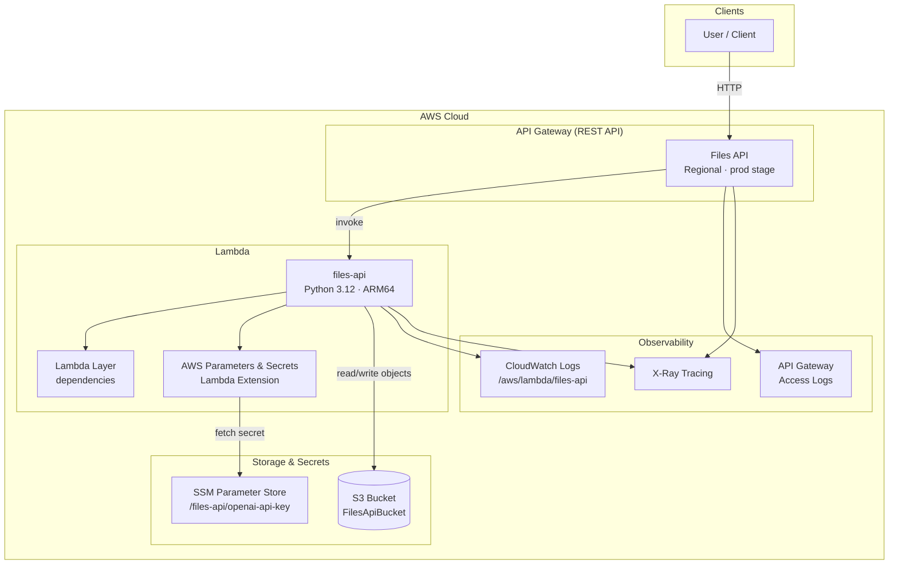
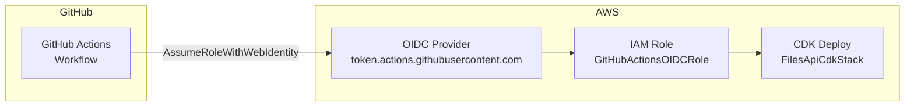
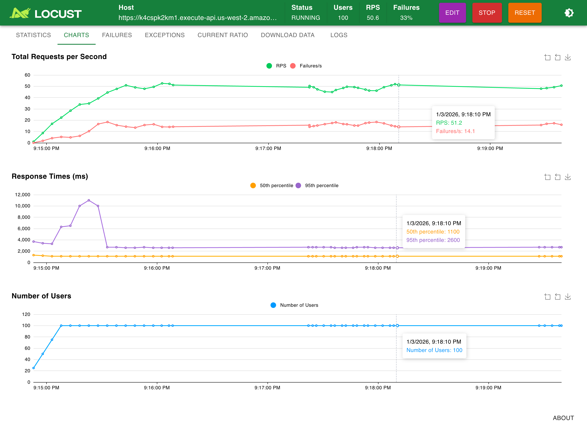

# Files API

<p align="left">
<a href="https://www.linkedin.com/in/avr27/" target="_blank">
    
</a>
<a href="https://mlops-club.org" target="_blank">
    
</a>
</p>

This project is a more polished version of the [cloud-engineering-project](https://github.com/avr2002/cloud-engineering-project) that we built during the [MLOps Club](https://mlops-club.org/) cohort of Taking Python to Production on AWS by [Eric Riddoch](https://www.linkedin.com/in/eric-riddoch/) and [me](https://www.linkedin.com/in/avr27/).


<p align="center">
    
</p>

***In this project, we built ––***

* A [RESTful API](https://aws.amazon.com/what-is/restful-api/) using FastAPI to do CRUD operations against an S3 bucket.
* Implemented principles of [12-factor app](https://12factor.net/) and [RESTful API design](https://restfulapi.net/).
* Dockerized the application for easy local development and deployment.
* Rigorously tested it using pytest with mocks for AWS S3 and OpenAI services.
* Setup load testing with Locust
* We wrote API Contract using OpenAPI spec, auto-generated from FastAPI code, with pre-commit hooks using `oasdiff` to catch breaking changes and OpenAPI Generator to create a Python client SDK for the API.
* Serverless Deployment: Deployed the app using AWS CDK with Docker on AWS Lambda and exposed it via API Gateway.
    > *NOTE: After deploying, make sure to update the secret in Secrets Manager with your OpenAI API key.*
  * Using AWS Secrets Manager to store OpenAI API keys and
  * Using [`AWS-Parameters-and-Secrets-Lambda-Extension`](https://docs.aws.amazon.com/lambda/latest/dg/with-secrets-manager.html) to securely fetch it inside the Lambda function.
* CI/CD Pipeline: Automated testing and deployment using GitHub Actions.
* Observability & Monitoring:
  * Setup in-depth logging on AWS CloudWatch using loguru.
  * Implemented tracing with AWS X-Ray, both correlating logs and traces using trace-IDs.
  * Custom Metrics with AWS CloudWatch Metrics using `aws-embedded-metrics`.


## TODO

- [x] Added Secret Manager to store OpenAI API key securely.
- [x] Used AWS SSM Parameter Store to store the OpenAI API key instead of Secrets Manager. [ref](docs/Secrets-Manager-and-SSM-Parameter-Store.md)
  - This is free to use and has no additional cost unlike Secrets Manager $0.40 per secret per month.
- [x] Setup the Dockerfile with the recommended way of using [uv in Docker](https://docs.astral.sh/uv/guides/integration/docker/).
  - [x] CDK rebuilds the Lambda Layer Docker image on every deployment. Is it possible to cache it locally and only rebuild when there are changes to files like `pyproject.toml` or `uv.lock`?
  - [ ] Try Docker multi-stage builds and configure [watch](https://docs.astral.sh/uv/guides/integration/docker/#configuring-watch-with-docker-compose) with docker compose.
- [x] Setup CI/CD pipeline to deploy the API to AWS using GitHub Actions.
  - [x] Used OpenID Connect to deploy to AWS in GitHub Actions.
  - [ ] Try AWS CodePipeline as alternative? [ref: [link1](https://youtu.be/EVDw0sdxaec?si=VcfZj52suQc_pxa5), [link2](https://docs.aws.amazon.com/cdk/v2/guide/cdk-pipeline.html)]
  - video: [The IDEAL & Practical CI / CD Pipeline - Concepts Overview](https://youtu.be/OPwU3UWCxhw?si=mmVkOFEaarkdp4eZ) - Be A Better Dev
- [ ] API Gateway Improvements:
  - [ ] Implement API versioning strategy (like v1 in the path).
  - [ ] API Gateway with multiple stages (dev/prod). [`aws-samples/aws-cdk-examples/api-stages-lambda`](https://github.com/aws-samples/aws-cdk-examples/tree/main/python/api-stages-lambda)
  - [ ] API Throttling and Usage Plans to manage API consumption and prevent abuse.
  - [ ] Deployment Stratgies like Blue-Green, Canary deployments, etc.
  - [ ] Implement authentication (API keys with Usage Plans/AWS Cognito/custom JWT/IAM Auth) and secure Swagger UI page and possiblly the API endpoints as well.
    - [ ] Add rate limiting to the API using API Gateway
    - [ ] Implement multi-environment deployment pipeline (dev/prod) with approval gates
- [ ] Observability & Monitoring improvements:
  - [ ] Cloudwatch Dashboard using CDK to visualize custom metrics, logs and traces in one place. [*ref*](https://github.com/cdk-patterns/serverless/tree/main/the-cloudwatch-dashboard/python)
  - [ ] Use OpenTelemetry for tracing instead of AWS X-Ray, [ref](https://aws.amazon.com/blogs/mt/aws-x-ray-sdks-daemon-migration-to-opentelemetry/).
  - [ ] Setup Grafana dashboards with CloudWatch data sources for enhanced monitoring
  - [ ] Replace Cloudwatch with Grafana Stack -- logs, metrics and traces
- [ ] Container Orchestration:
  - [ ] Containerize the app and deploy it using Application Load Balancer
    - [ ] ECS Fargate (Serverless)
    - [ ] Amazon EC2
  - [ ] Setup auto-scaling based on request load or CPU/memory usage
  - [ ] Deploy on Kubernetes EKS (Kubernetes)
- [ ] Add custom domain with Route53 and ACM for HTTPS (`https://api.myapp.com/v1/`)

## Setup

Install [`uv`](https://docs.astral.sh/uv/getting-started/installation/), [aws-cli v2](https://docs.aws.amazon.com/cli/latest/userguide/getting-started-install.html) and [node.js](https://nodejs.org/en/download) before running.


- Clone the repo
    ```bash
    git clone https://github.com/avr2002/files-api.git
    ```

- Install dependencies
    ```bash
    uv sync --all-groups
    ```

- If you are using AWS SSO, you can activate your profile by running the following command:

    ```bash
    # AWS_PROFILE=sandbox
    aws configure sso --profile sandbox
    # OR
    aws sso login --profile sandbox
    ```

- Setup Infra
    ```bash
    # Bootstrap the CDK environment
    ./run cdk-bootstrap

    # Deploy the CDK stack
    # This will create the S3 bucket and SageMaker domain
    ./run cdk-deploy
    ```

- Create a `.openai.env` file with your OpenAI API key
  ```bash
  export OPENAI_API_KEY=your_openai_api_key_here
  ```

- Clean Up
    ```bash
    # Destroy infra
    ./run cdk-destroy

    # Clean up local files
    ./run clean
    ```

## Usage

- Start the API locally with mock S3 and OpenAI services
    ```bash
    ./run run-mock
    ```

- Run locally with Docker
    ```bash
    ./run run-docker
    ```
    ^^^ If you want to use real AWS credentials and OpenAI Service, modify the [docker-compose.yaml](./docker-compose.yaml) file

- Run with Locust for load testing
    ```bash
    ./run run-locust
    ```
    ^^^ If you want to load test against deployed API, modify the [docker-compose.locust.yaml](./docker-compose.locust.yaml) file with the deployed API Gateway URL

- Generate OpenAPI spec
    ```bash
    uv run scripts/generate-openapi.py generate --output-spec=openapi.json
    ```

- Generate the client library from OpenAPI spec
    ```bash
    ./run generate-client-library
    ```

- Run tests with coverage
    ```bash
    ./run run-tests

    # Serve the HTML coverage report
    ./run serve-coverage-report
    ```
    

- Lint the codebase
    ```bash
    ./run lint
    # OR
    ./run lint:ci
    ```

## Architecture

The app is deployed on AWS using CDK. Below diagram shows the main components and how they interact.



**CI/CD (GitHub Actions with OIDC):**



| Component | Description |
|-----------|-------------|
| **API Gateway** | REST API (regional), `prod` stage; GET on `/`, ANY on `/{proxy+}`; X-Ray and access logging enabled. |
| **Lambda** | `files-api` function (Python 3.12, ARM64); custom layer for dependencies; AWS Parameters and Secrets Lambda Extension to read SSM/Secrets Manager. |
| **S3** | Bucket for file storage; Lambda has read/write access. |
| **SSM Parameter Store** | SecureString `/files-api/openai-api-key` for OpenAI API key (created manually). |
| **Observability** | CloudWatch Logs for Lambda and API Gateway access logs; X-Ray tracing for Lambda and API Gateway. |
| **GitHub OIDC** | Optional stack (`github_oidc_infra.py`) creates an OIDC provider and IAM role so GitHub Actions can deploy the CDK stack without long-lived credentials. |

## Images

### Load Testing with Locust:

<p align="center">
    
    <text>Locust Dashboard showing Deployed API performance under load</text><br>
</p>


### Traces:

<p align="center">
    
    <text>X-Ray Trace with Correlated Logs for a successful PUT Request</text><br>
</p>

<p align="center">
    
    <text>X-Ray Trace with Correlated Logs for a failed POST Request</text><br>
</p>


### Metrics:


#### Custom CloudWatch Metrics:

<p align="center">
    
    <text>Unhandled Exceptions</text><br>
</p>
<p align="center">
    
    <text>S3 Bytes Downloaded</text><br>
</p>
<p align="center">
    
    <text>S3 Bytes Uploaded</text><br>
</p>

#### API Gateway Metrics:

<p align="center">
    
    <text>API Gateway 4XX and 5XX Errors Metric</text><br>
</p>

<p align="center">
    
    <text>API Gateway P95 Latency</text><br>
</p>


Similary, you can view other metrics like Lambda Invocations, Duration, Errors, Throttles etc. and for S3 as well.


## Contributing

Contributions are welcome!
- Complete the setup process above
- Make your changes
- Run tests and linting, and
- Submit a pull request.
