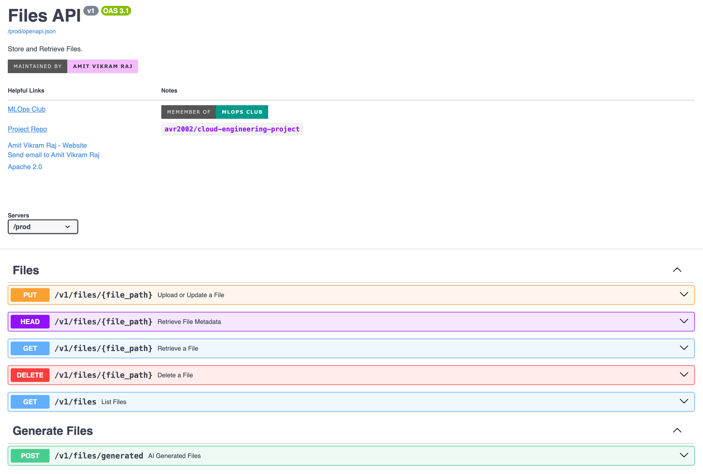
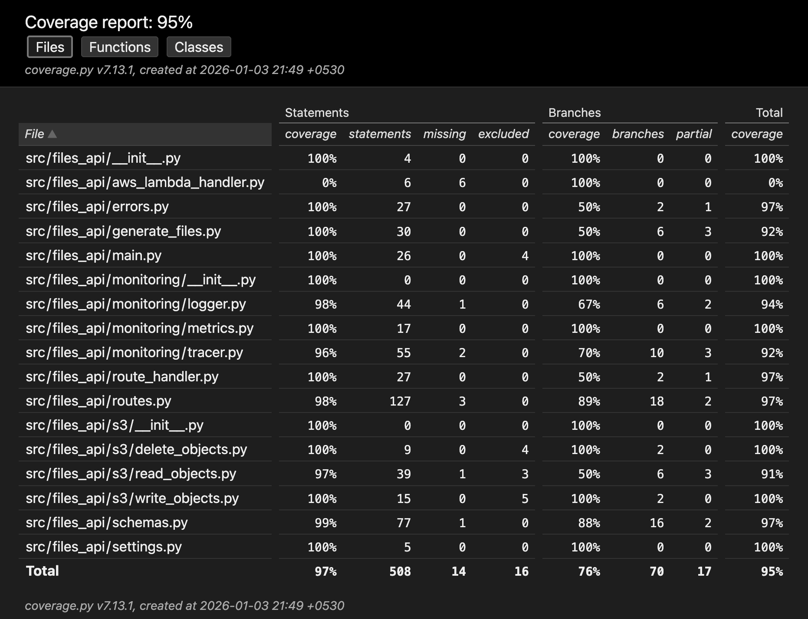
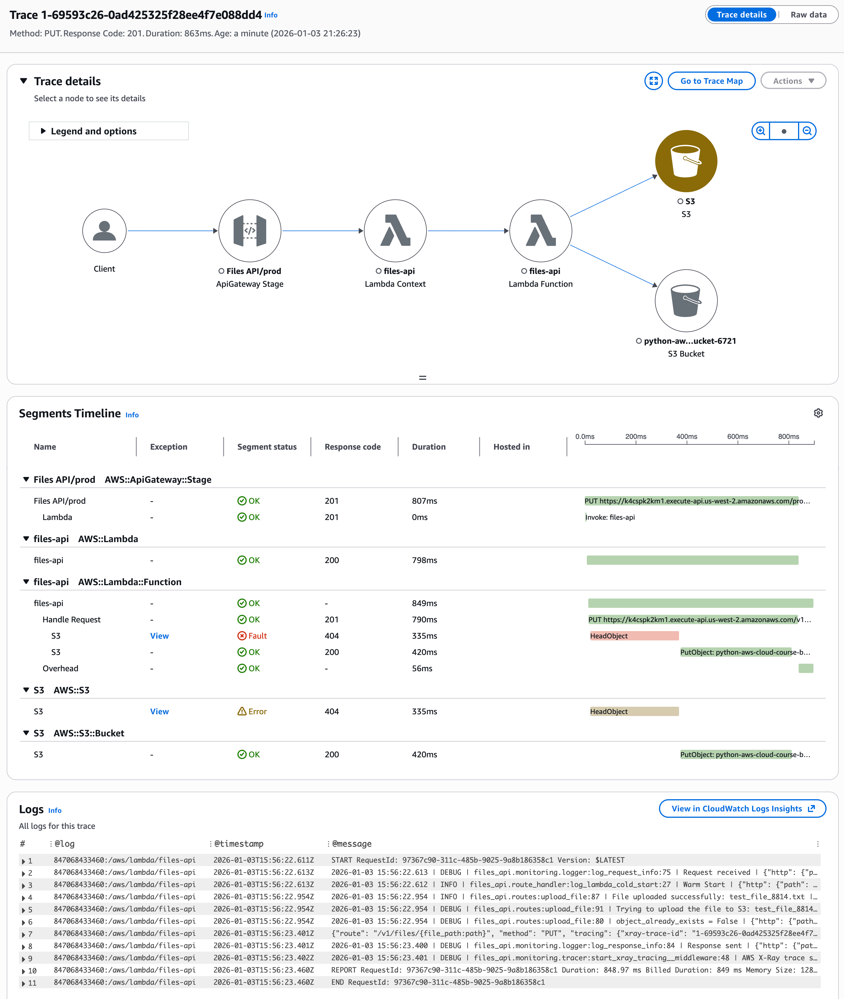
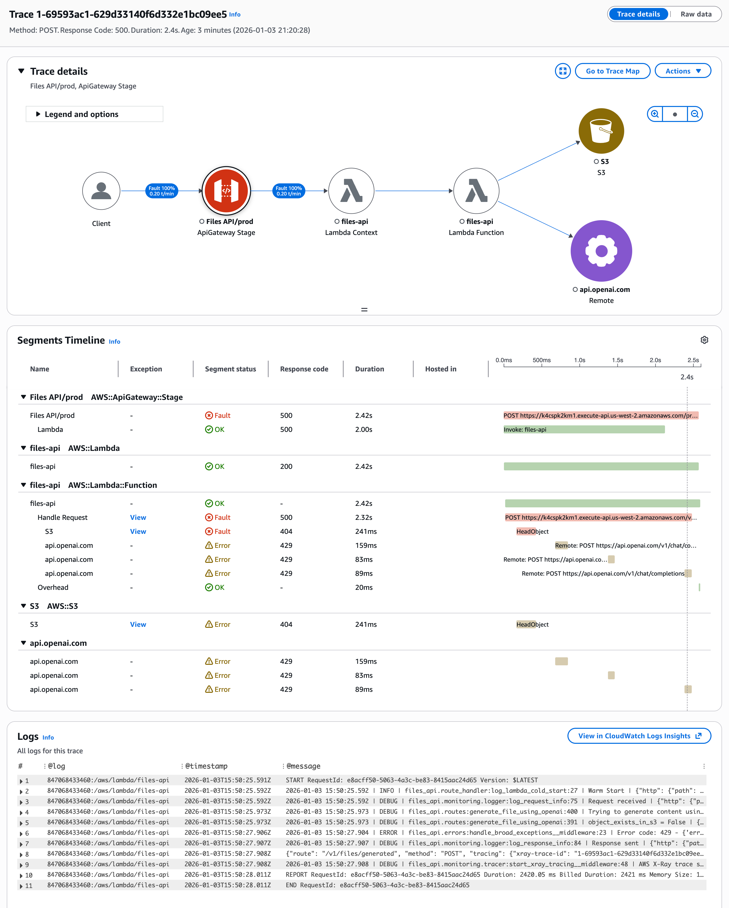
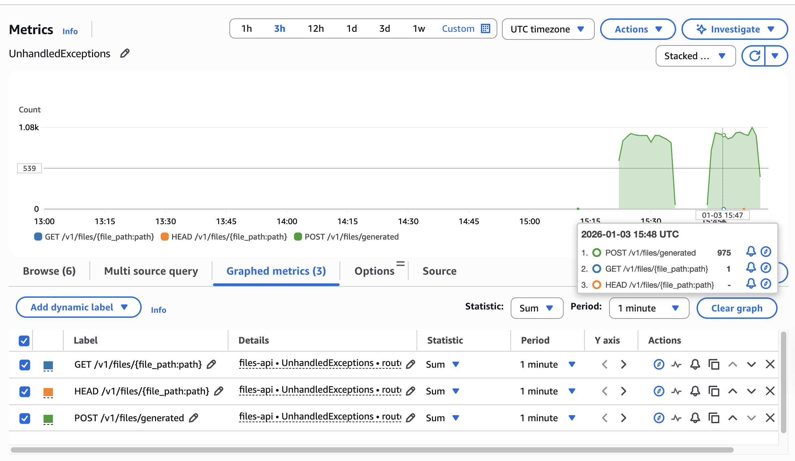
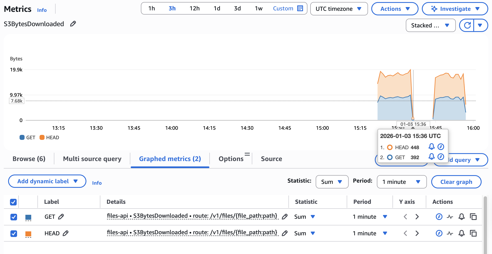
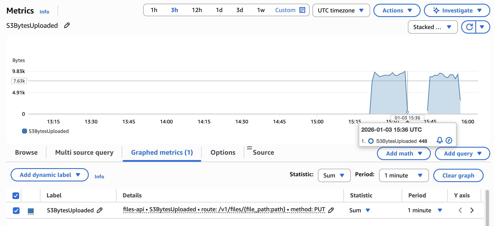
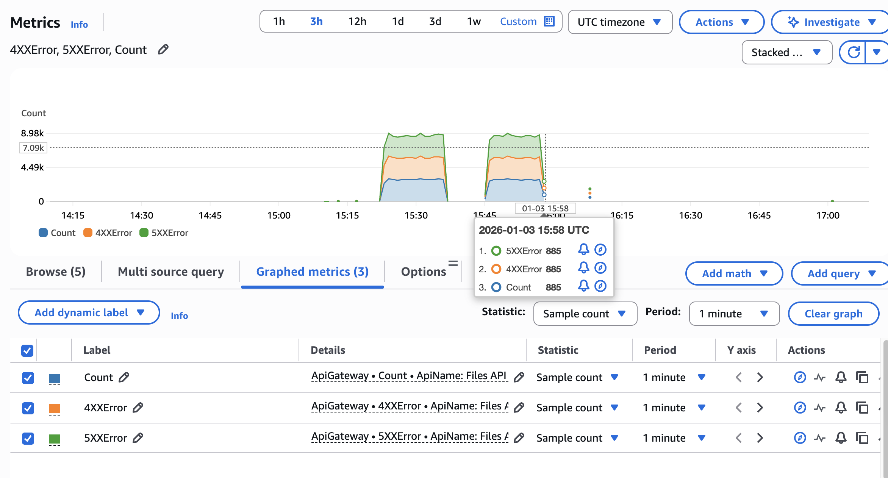
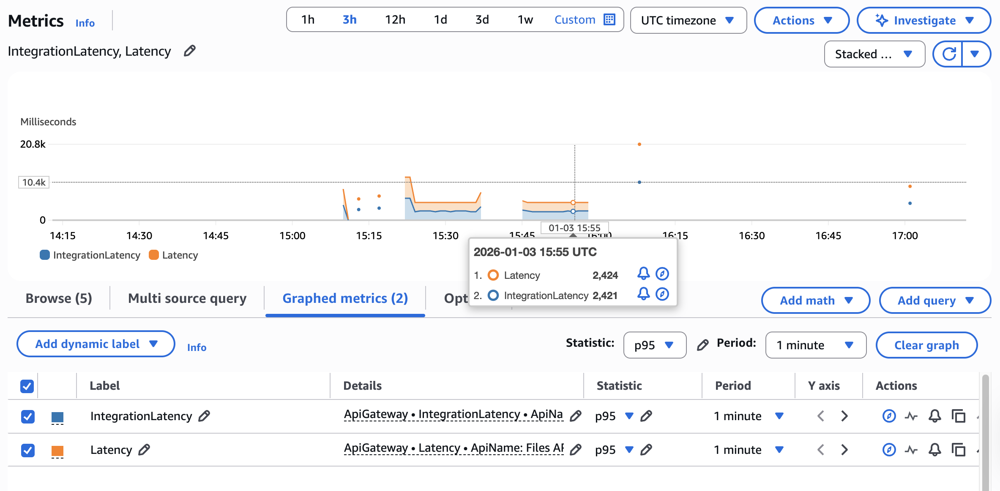

# Files API

This project is a more polished version of the [cloud-engineering-project](https://github.com/avr2002/cloud-engineering-project) that we built during the [MLOps Club](https://mlops-club.org/) cohort of Taking Python to Production on AWS by [me](https://www.linkedin.com/in/avr27/) and [Eric Riddoch](https://www.linkedin.com/in/eric-riddoch/).


<p align="center">
    
</p>

In this project, we built --

* A [RESTful API](https://aws.amazon.com/what-is/restful-api/) using FastAPI to do CRUD operations against an S3 bucket.
* Implemented principles of [12-factor app](https://12factor.net/) and [RESTful API design](https://restfulapi.net/).
* Dockerized the application for easy local development and deployment.
* Rigorously tested it using pytest with mocks for AWS S3 and OpenAI services.
* Setup load testing with Locust
* Serverless Deployment: Deployed the app using AWS CDK with Docker on AWS Lambda and exposed it via API Gateway.
* CI/CD Pipeline: Automated testing and deployment using GitHub Actions.
* Observability & Monitoring:
  * Setup in-depth logging on AWS CloudWatch using loguru.
  * Implemented tracing with AWS X-Ray, both correlating logs and traces using trace-IDs.
  * Custom Metrics with AWS CloudWatch Metrics using `aws-embedded-metrics`.


## Setup

Install [`uv`](https://docs.astral.sh/uv/getting-started/installation/) and node.js before running.

- If you are using AWS SSO, you can activate your profile by running the following command:

    ```bash
    # AWS_PROFILE=sandbox
    aws configure sso --profile sandbox
    # OR
    aws sso login --profile sandbox
    ```

- Setup Infra
    ```bash
    # Bootstrap the CDK environment
    ./run cdk-bootstrap

    # Deploy the CDK stack
    # This will create the S3 bucket and SageMaker domain
    ./run cdk-deploy
    ```

- Create a `.openai.env` file with your OpenAI API key

- Clean Up
    ```bash
    # Destroy infra
    ./run cdk-destroy

    # Clean up local files
    ./run clean
    ```

## Usage

- Start the API locally with mock S3 and OpenAI services
    ```bash
    ./run run-mock
    ```

- Run locally with Docker
    ```bash
    ./run run-docker
    ```
    ^^^ If you want to use real AWS credentials and OpenAI Service, modify the [docker-compose.yaml](./docker-compose.yaml) file

- Run with Locust for load testing
    ```bash
    ./run run-locust
    ```

- Generate OpenAPI spec
    ```bash
    uv run scripts/generate-openapi.py generate --output-spec=openapi.json
    ```

- Generate the client library from OpenAPI spec
    ```bash
    ./run generate-client-library
    ```

- Run tests with coverage
    ```bash
    ./run run-tests

    # Serve the HTML coverage report
    ./run serve-coverage-report
    ```
    

- Lint the codebase
    ```bash
    ./run lint
    # OR
    ./run lint:ci
    ```

## Images

### Traces:

<p align="center">
    
    <text>X-Ray Trace with Correlated Logs for a successful PUT Request</text><br>
</p>

<p align="center">
    
    <text>X-Ray Trace with Correlated Logs for a failed POST Request</text><br>
</p>


### Metrics:


#### Custom CloudWatch Metrics:

<p align="center">
    
    <text>Unhandled Exceptions</text><br>
</p>
<p align="center">
    
    <text>S3 Bytes Downloaded</text><br>
</p>
<p align="center">
    
    <text>S3 Bytes Uploaded</text><br>
</p>

#### API Gateway Metrics:

<p align="center">
    
    <text>API Gateway 4XX and 5XX Errors Metric</text><br>
</p>

<p align="center">
    
    <text>API Gateway P95 Latency</text><br>
</p>


Similary, you can view other metrics like Lambda Invocations, Duration, Errors, Throttles etc. and for S3 as well.

