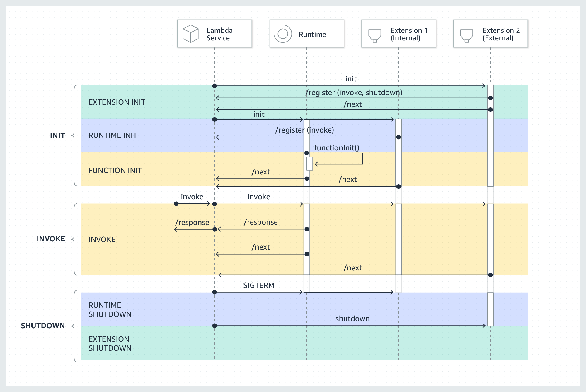

# Storing Secrets in AWS Secrets Manager & AWS SSM Parameter Store

This is not an article delving into the details of AWS Secrets Manager or SSM Parameter Store, but a quick overview of how to use them to store secrets like API keys like I did in [this project](https://github.com/avr2002/files-api).

## AWS Secrets Manager

AWS Secrets Manager helps you to securely store, rotate, and manage sensitive information like API keys, database credentials, OAuth tokens, and other secrets. Instead of hardcoding credentials in your application code, you can store them in Secrets Manager and retrieve them programmatically during runtime when needed.

Secrets Manager provides several benefits:

* Provides automatic rotation of secrets like database credentials.
* It has built-in support for Amazon RDS, Redshift, DocumentDB, and can be extended to other types of secrets like:
  * custom database Credentials
  * managed external secrets by third-party vendors
  * Other types of secrets like API keys, OAuth tokens, etc.
* Secrets are encrypted at rest using AWS KMS.
* Fine-grained access control using AWS IAM policies.
* Supports multi-region replication for high availability.
* Supports better monitoring and [versioning of secrets](https://docs.aws.amazon.com/secretsmanager/latest/userguide/whats-in-a-secret.html).
  * The current version – AWSCURRENT
  * The previous version – AWSPREVIOUS
  * The pending version (during rotation) – AWSPENDING


### Pricing

> [*AWS Secrets Manager Pricing*](https://aws.amazon.com/secrets-manager/pricing/) *page*.

* AWS Charges $0.40 per secret per month and $0.05 per 10,000 API calls to retrieve secrets.
* For secrets that are stored for less than a month, the price is prorated (based on the number of hours.)


### Setting up Secrets Manager in CDK

When creating secrets in AWS Secrets Manager using AWS CDK, it is recommended to avoid hardcoding the secret value directly in the CDK code. This is because the secret value will be included in the output of the CDK synthesis process and will appear in the CloudFormation template, which can lead to security risks.

The recommended approach is to create the secret without specifying the secret value in the CDK code. After deploying the stack, you can manually add the secret value in the Secrets Manager console. Secrets Manager will automatically create a placeholder or empty secret for you during deployment.

Here is an example of how to create a simple plain-text secret in Secrets Manager using CDK and grant read permissions to a Lambda function:

```python
import aws_cdk as cdk
from aws_cdk import (
    Stack,
    aws_lambda as _lambda,
    aws_secretsmanager as secretsmanager,
)
from constructs import Construct


class MyCDKStack(Stack):

    def __init__(self, scope: Construct, construct_id: str, **kwargs) -> None:
        super().__init__(scope, construct_id, **kwargs)

        # Create a new secret in Secrets Manager
        my_super_secret_api_key = secretsmanager.Secret(
            self,
            id="SuperSecretApiKey",
            description="Super secret API key for my Lambda function",
            secret_name="my-app/super-secret-api-key",
            # secret_string_value=...,
            # ^^^AWS discourages to pass the secret value directly in the CDK code as the value will be included in the
            # output of the cdk as part of synthesis, and will appear in the CloudFormation template in the console
            removal_policy=cdk.RemovalPolicy.DESTROY,
        )
        # ^^^The recommended way is to leave this field empty and manually add the secret value in the Secrets Manager console after deploying the stack.
        # AWS Secrets Manager will automatically create a placeholder/empty secret for you
        # The secret exists in AWS, but initially has no value (or a generated random value depending on the context).

        # This way, the secret value never appears in code, outputs, or CloudFormation templates.

        # Create a Lambda function that uses the secret
        my_lambda = _lambda.Function(
            self,
            id="MyLambdaFunction",
            function_name="my-lambda-function",
            runtime=_lambda.Runtime.PYTHON_3_12,
            architecture=_lambda.Architecture.ARM_64,
            handler="lambda_function.lambda_handler",
            code=_lambda.Code.from_asset("lambda"),
            environment={
                "SUPER_SECRET_API_KEY_NAME": my_super_secret_api_key.secret_name
            }
        )

        # Grant the Lambda function permission to read the secret
        my_super_secret_api_key.grant_read(my_lambda)
```


### Accessing secrets in AWS Lambda

There are multiple ways to access secrets within an AWS Lambda function. In all the cases, you need to mindful of Secrets Manager costs of $0.05 per 10,000 API calls to retrieve secrets.

1. Using boto3 SDK API calls to fetch the secret from Secrets Manager.
   * This is straightforward.
   * You need to handle caching of the secret to avoid fetching it on every invocation, managing retries, and error handling for API calls.

    ```python
    import boto3
    import json
    import os
    from botocore.exceptions import ClientError

    # Global variable to cache the secret after the initial retrieval
    _CACHED_SECRET: str | None = None

    def get_secret():
        """Retrieves the secret from Secrets Manager, with in-memory caching."""
        session = boto3.session.Session()
        client = session.client(service_name='secretsmanager', region_name="us-west-2")

        try:
            get_secret_value_response = client.get_secret_value(SecretId="my-app/super-secret-api-key")
        except ClientError as e:
            # Handle exceptions such as ResourceNotFoundException
            raise e
        
        # Decrypts secret using the associated KMS key.
        if 'SecretString' in get_secret_value_response:
            return get_secret_value_response['SecretString']
        else:
            # Handle SecretBinary if necessary (e.g., decode base64)
            raise ValueError("SecretString not found, SecretBinary not implemented in this example")

    def lambda_handler(event, context):
        # Retrieve the secret (uses cache if available)
        global CACHED_SECRET

        # This will only fetch the secret once during the first invocation
        if CACHED_SECRET is None:
            CACHED_SECRET = get_secret()
            os.environ["MY_API_KEY"] = CACHED_SECRET
        
        # ... DO STUFF WITH THE SECRET ...

        return {
            'statusCode': 200,
            'body': json.dumps('Secret retrieved and used successfully!')
        }

    ```


2. Use the `AWS-Parameters-and-Secrets-Lambda-Extension` to securely fetch secrets inside the Lambda function.

    The AWS Parameters and Secrets Lambda Extension is an AWS-managed Lambda layer that provides a local, in-memory cache for parameters from AWS Systems Manager Parameter Store and secrets from AWS Secrets Manager.

    * This extension provides built-in caching(default TTL is 300 seconds) and reduces the complexity of managing API calls.
    * However, it may slightly increase cold start times due to extension initialization.
    * You need to ensure that the extension is ready before fetching the secret, possibly implementing a retry mechanism, otherwise you may encounter errors like `HTTP Error 400: Bad Request`.

    <p align="center">
    <br>
    <em>Lambda Execution Environment Lifecycle</em>
    </p>
    Read more about how Lambda execution environment gets initialized <a href="https://docs.aws.amazon.com/lambda/latest/dg/runtimes-extensions-api.html#runtimes-extensions-api-lifecycle">here</a>.
    <br><br>


    ***Adding the extension to your Lambda function:***

    * The extension is available both X86_64 and ARM64 architectures. You can find the layer ARNs [here](https://docs.aws.amazon.com/systems-manager/latest/userguide/ps-integration-lambda-extensions.html#ps-integration-lambda-extensions-add).

    ```python
    class MyCDKStack(Stack):

        def __init__(self, scope: Construct, construct_id: str, **kwargs) -> None:
            super().__init__(scope, construct_id, **kwargs)

            # Add AWS parameters and secrets Lambda extension to read secrets from Secrets Manager
            # ref: https://docs.aws.amazon.com/secretsmanager/latest/userguide/retrieving-secrets_lambda.html
            # ref: https://docs.aws.amazon.com/lambda/latest/dg/with-secrets-manager.html
            secrets_manager_lambda_extension_layer = _lambda.LayerVersion.from_layer_version_arn(
                self,
                id="SecretsManagerExtensionLayer",
                layer_version_arn=f"arn:aws:lambda:{self.region}:345057560386:layer:AWS-Parameters-and-Secrets-Lambda-Extension-Arm64:23",
            )
            # ^^^I found the layer ARN here from the AWS docs:
            # https://docs.aws.amazon.com/systems-manager/latest/userguide/ps-integration-lambda-extensions.html#ps-integration-lambda-extensions-add

            # Create the Lambda function
            my_lambda = _lambda.Function(
                self,
                id="MyLambdaFunction",
                function_name="my-lambda-function",
                runtime=_lambda.Runtime.PYTHON_3_12,
                architecture=_lambda.Architecture.ARM_64,
                ...
                layers=[secrets_manager_lambda_extension_layer],  # Add the extension layer
                ...
            )
    ```


    ***Usage:***

    ```python
    import os
    import urllib.request
    import json

    # ref: https://docs.aws.amazon.com/systems-manager/latest/userguide/ps-integration-lambda-extensions.html
    def get_secret_from_extension(secret_name: str) -> str:
        """Retrieves a secret value from the Secrets Manager extension."""
        # The extension runs on localhost port 2773 by default
        extension_routing_port: str = os.getenv("AWS_LAMBDA_RUNTIME_API_PORT", "2773")

        # AWS_SESSION_TOKEN is required for authentication with the extension with the Secrets Manager
        aws_session_auth_token: str = os.environ["AWS_SESSION_TOKEN"]

        endpoint = f"http://localhost:{extension_routing_port}/secretsmanager/get?secretId={secret_name}"

        # Use the session token to authenticate with the extension
        req = urllib.request.Request(url=endpoint)
        req.add_header("X-Aws-Parameters-Secrets-Token", aws_session_auth_token)

        # Request/Respone Syntax: https://docs.aws.amazon.com/secretsmanager/latest/apireference/API_GetSecretValue.html
        with urllib.request.urlopen(req) as response:
            secret_response = response.read().decode("utf-8")
            # The response is a JSON string containing the secret value
            secret_data = json.loads(secret_response)
            return secret_data["SecretString"]


    CACHED_SECRET: str | None = None

    def lambda_handler(event, context):
        global CACHED_SECRET
        if CACHED_SECRET is None:
            CACHED_SECRET = get_secret_from_extension(secret_name=os.environ["SUPER_SECRET_API_KEY_NAME"])
            os.environ["MY_API_KEY"] = CACHED_SECRET
            # ^^^We are fetching the secret inside the lambda_handler to ensure the extension is fully initialized and ready.
            # Accessing the secret outside the handler function (during module import) can lead to issues because the extension might not be ready yet.

        # ... DO STUFF WITH THE SECRET ...

        return {
            'statusCode': 200,
            'body': json.dumps('Secret retrieved and used successfully!')
        }
    ```


3. Using the [`aws-lambda-powertools` Parameters utility](https://docs.aws.amazon.com/powertools/python/latest/utilities/parameters/) to fetch secrets.
   
   * This utility provides built-in caching and simplifies secret retrieval.
   * However, it adds an additional dependency to your Lambda function, if you are okay with that.
   * The Parameters utility has other functionalities as well and integrates with other AWS services like SSM Parameter Store, AppConfig along with Secrets Manager.

    ```python
    from aws_lambda_powertools import Logger
    from aws_lambda_powertools.utilities import parameters

    logger = Logger()

    def lambda_handler(event, context):
        try:
            # Get secret with caching (default TTL: 5 seconds)
            secret_value = parameters.get_secret("my-app/super-secret-api-key")
            
            # Get secret with custom TTL
            secret_with_ttl = parameters.get_secret("my-app/super-secret-api-key", max_age=300)
            
            # Get secret and transform JSON
            secret_json = parameters.get_secret("my-app/super-secret-api-key", transform="json")
            
            logger.info("Successfully retrieved secrets")
            
            return {
                'statusCode': 200,
                'body': 'Successfully retrieved secrets'
            }
            
        except Exception as e:
            logger.error(f"Error retrieving secret: {str(e)}")
            return {
                'statusCode': 500,
                'body': f'Error: {str(e)}'
            }
    ```


## AWS SSM Parameter Store

AWS Systems Manager helps you manage, configure, and operate your compute resources and applications without logging into them.

It lets you:
* Store configuration
* Run commands
* Automate fixes
* Patch systems
* See what’s running where
    
    —all from the AWS console or API.


One of the services provided by SSM is Parameter Store, which allows you to securely store app configs and secrets like API keys, database connection strings, and other sensitive information.

### Pricing

AWS Systems Manager Parameter Store consists of standard and advanced parameters.

> [Pricing Page](https://aws.amazon.com/systems-manager/pricing/) for SSM Parameter Store.
> 
> [Docs: Parametes Tiers](https://docs.aws.amazon.com/systems-manager/latest/userguide/parameter-store-advanced-parameters.html)

* Standard parameters are available at no additional charge.
  * For API interactions, standard parameters are free.
  * But charges incur for high throughput tier API interactions.
* For advanced parameters $0.05/advanced parameter/month for both storing and API interactions.

>*A Parameter Store API interaction is defined as an interaction between an API request and an individual parameter. For example, if a Get request returns ten parameters, that counts as ten Parameter Store API interactions.*

There is also a Intelligent Tier that automatically moves parameters between standard and advanced tiers based on usage patterns.

### SSM Parameter Store

* AWS defines a Parameter as:

    >A Parameter Store parameter is any piece of data that is saved in Parameter Store, such as a block of text, a list of names, a password, an AMI ID, a license key, and so on.
    >
    >A parameter is referenced using the following convention: `{{ssm:parameter-name}}`

* Parameter Store has different size limits for parameter values depending on the parameter tier you use:
  * Standard parameters: Maximum value size of 4 KB
  * Advanced parameters: Maximum value size of 8 KB

* Parameter Store provides support for three types of parameters: `String`, `StringList`, and `SecureString`.

* `SecureString` data is encrypted and decrypted using an AWS KMS key.
  * You can use either a default KMS key provided by AWS or create and use your own AWS KMS key. 
  * The AWS managed key is free to use, but if you create your own KMS key, you will incur charges for using it.
  * Read more about [AWS KMS Pricing here](https://docs.aws.amazon.com/kms/latest/developerguide/concepts.html)

* For the purposes of this article, we could store our secret API Key as a `SecureString` parameter in Parameter Store.

* For simpler use case, this could help you avoid the Secrets Manager costs of $0.40 per secret per month, if you have only a few secrets to store.
  * In both cases, you will still incur the API interaction costs if you are making frequent calls to retrieve the secrets.
  * Nothing changes, you still access the secrets in the same way as shown above using boto3 SDK calls, Lambda Extension or aws-lambda-powertools Parameters utility.
  * The trade-off is mainly around the specific features provided by Secrets Manager that you may need depending on your use case.

> *You can read more about SSM Parameter Store in the [official docs](https://docs.aws.amazon.com/systems-manager/latest/userguide/systems-manager-parameter-store.html).*


### Setting up SSM Parameter Store in CDK

CloudFormation (AWS::SSM::Parameter) does not support creating `SecureString` parameters. Therefore, CDK cannot create SecureString directly.

Recommended option:
* Create the SecureString parameter outside CDK (preferrably manually in console), then reference it in CDK and grant IAM read to the resource that needs it.

Example CDK referencing an existing SecureString and granting read to a Lambda:

```python
import aws_cdk as cdk
from aws_cdk import (
    Stack,
    aws_lambda as _lambda,
    aws_ssm as ssm,
)
from constructs import Construct


class MyCDKStack(Stack):
    def __init__(self, scope: Construct, construct_id: str, **kwargs) -> None:
        super().__init__(scope, construct_id, **kwargs)

        # Reference an existing SecureString parameter (created outside CDK)
        secure_param = ssm.StringParameter.from_secure_string_parameter_attributes(
            self,
            id="ExistingSuperSecretParam",
            parameter_name="/my-app/super-secret-api-key",
            # version=1,  # Optional: pin a specific version
        )

        # Lambda that reads the SecureString parameter
        my_lambda = _lambda.Function(
            self,
            id="MyLambdaUsingSSMParam",
            function_name="my-lambda-ssm-param",
            runtime=_lambda.Runtime.PYTHON_3_12,
            architecture=_lambda.Architecture.ARM_64,
            handler="lambda_function.lambda_handler",
            code=_lambda.Code.from_asset("lambda"),
            environment={
                "SUPER_SECRET_PARAM_NAME": "/my-app/super-secret-api-key",
            },
        )

        # Grant read permissions to the Lambda
        secure_param.grant_read(my_lambda)
```

### Accessing SSM SecureString parameters in AWS Lambda

1. Using boto3:

    ```python
    import boto3
    import json
    import os
    from botocore.exceptions import ClientError

    _CACHED_PARAM: str | None = None

    def get_parameter_value(name: str) -> str:
        """Retrieve SecureString from SSM with decryption."""
        client = boto3.client(service_name="ssm", region_name="us-west-2")
        try:
            resp = client.get_parameter(Name=name, WithDecryption=True)
        except ClientError as e:
            raise e

        return resp["Parameter"]["Value"]

    def lambda_handler(event, context):
        global _CACHED_PARAM

        if _CACHED_PARAM is None:
            _CACHED_PARAM = get_parameter_value(os.environ["SUPER_SECRET_PARAM_NAME"])
            os.environ["MY_API_KEY"] = _CACHED_PARAM

        # ... use the secret ...

        return {
            "statusCode": 200,
            "body": json.dumps("Parameter retrieved and used successfully!")
        }
    ```

2. Using the AWS Parameters and Secrets Lambda Extension:

    We will use the same managed layer ARN as in the Secrets Manager section (supports both SSM and Secrets).

    ```python
    import os
    import urllib.request
    import json


    # ref: https://docs.aws.amazon.com/systems-manager/latest/userguide/ps-integration-lambda-extensions.html
    def get_parameter_from_extension(name: str, decrypt: bool = True) -> str:
        """Retrieve an SSM parameter via the local extension with optional decryption."""
        extension_port: str = os.getenv("AWS_LAMBDA_RUNTIME_API_PORT", "2773")
        aws_session_auth_token: str = os.environ["AWS_SESSION_TOKEN"]

        endpoint = f"http://localhost:{extension_port}/systemsmanager/parameters/get?name={name}"
        if decrypt:
            endpoint += "&withDecryption=true"

        req = urllib.request.Request(url=endpoint)
        req.add_header("X-Aws-Parameters-Secrets-Token", aws_session_auth_token)

        with urllib.request.urlopen(req) as response:
            data = json.loads(response.read().decode("utf-8"))
            # Response shape mirrors SSM GetParameter API
            return data["Parameter"]["Value"]

    _CACHED_PARAM: str | None = None

    def lambda_handler(event, context):
        global _CACHED_PARAM

        if _CACHED_PARAM is None:
            _CACHED_PARAM = get_parameter_from_extension(os.environ["SUPER_SECRET_PARAM_NAME"], decrypt=True)
            os.environ["MY_API_KEY"] = _CACHED_PARAM
            # Fetch inside handler to ensure the extension is ready

        # ... use the secret ...

        return {
            "statusCode": 200,
            "body": json.dumps("Parameter retrieved and used successfully!")
        }
    ```

3. Using aws-lambda-powertools Parameters utility:
    ```python
    from aws_lambda_powertools import Logger
    from aws_lambda_powertools.utilities import parameters

    logger = Logger()

    def lambda_handler(event, context):
        try:
            # Get SecureString with decryption and default caching (TTL 5s)
            secure_value = parameters.get_parameter("/my-app/super-secret-api-key", decrypt=True)

            # Custom TTL
            secure_value_ttl = parameters.get_parameter("/my-app/super-secret-api-key", decrypt=True, max_age=300)

            # Retrieve multiple parameters by path
            params = parameters.get_parameters_by_path("/my-app/", decrypt=True, recursive=True, max_age=300)

            logger.info("Successfully retrieved parameters")
            return {"statusCode": 200, "body": "Successfully retrieved parameters"}

        except Exception as e:
            logger.error(f"Error retrieving parameter: {str(e)}")
            return {"statusCode": 500, "body": f"Error: {str(e)}"}
    ```

Notes:
- Grant your Lambda IAM permissions: ssm:GetParameter (and optionally ssm:GetParametersByPath), plus kms:Decrypt if using a self-managed KMS key.
- Standard vs Advanced tier affects value size limits and throughput/pricing; use caching to reduce API calls.


## Naming Conventions

There isn't any strict enforced naming convention. However, often people follow a heirarchical naming convention to organize secrets and parameters that reflects the application structure, environment, and purpose.

Use path-style names that describe:
```md
/<environment>/<app>/<scope>/<name>

# For example:

/prod/payments/secrets/stripe_api_key
/prod/payments/secrets/db_password

/dev/payments/config/api_base_url
/dev/payments/config/request_timeout
```

This enables simple IAM rules like:

```json
{
  "Effect": "Allow",
  "Action": "ssm:GetParameter",
  "Resource": "arn:aws:ssm:region:account-id:parameter/prod/payments/*"
}
```

SSM Parameter Store has a concept of "simple names" vs "path-like names".

```python
from aws_cdk import aws_ssm as ssm, aws_lambda as _lambda

# Simple name (no "/"): set simple_name=True
# A parameter name without any "/" is considered a simple name.
simple_parameter = ssm.StringParameter(
    self,
    "StringParameterSimple",
    parameter_name="parameter",
    string_value="SOME_VALUE",
    simple_name=True,
)

# Assume you already have a Lambda function reference
func: _lambda.IFunction = my_lambda  # replace with your function

# Path-like name (contains "/"): set simple_name=False
non_simple_parameter = ssm.StringParameter(
    self,
    "StringParameterNonSimple",
    parameter_name=f"/{func.function_name}/my/app/param",
    string_value="SOME_VALUE",
    simple_name=False,
)
```

^^^ref:
- [Using a hierarchical naming convention for secrets](https://docs.aws.amazon.com/prescriptive-guidance/latest/secure-sensitive-data-secrets-manager-terraform/naming-convention.html)
- [Working with parameter hierarchies in Parameter Store](https://docs.aws.amazon.com/systems-manager/latest/userguide/sysman-paramstore-hierarchies.html)


# References:

Docs:

- [AWS Secrets Manager User Guide](https://docs.aws.amazon.com/secretsmanager/latest/userguide/intro.html)
- [CDK Docs](https://docs.aws.amazon.com/secretsmanager/latest/userguide/cdk.html)
- [AWS Blog Post](https://aws.amazon.com/blogs/compute/using-the-aws-parameter-and-secrets-lambda-extension-to-cache-parameters-and-secrets/) on using the extension.
- [Extension Docs](https://docs.aws.amazon.com/lambda/latest/dg/with-secrets-manager.html) for using Secrets Manager and settings via Environment Variables.
- [Extension Docs](https://docs.aws.amazon.com/systems-manager/latest/userguide/ps-integration-lambda-extensions.html) for using SSM Parameter Store and settings via Environment Variables.
- [Docs: `aws-lambda-powertools` Parameters](https://docs.aws.amazon.com/powertools/python/latest/utilities/parameters/) Utility.

- There is a nice blog plost by AWS on choosing AWS services for managing secrets and configurations: [**link**](https://aws.amazon.com/blogs/security/how-to-choose-the-right-aws-service-for-managing-secrets-and-configurations/)

Be a Better Dev YT Videos:
- [AWS Lambda and Secrets Manager Tutorial in Python](https://youtu.be/pt9nAS4PVBI?si=lMBqLThf6pRznqsO)
- [AWS Secrets Manager Service Overview with Demo](https://youtu.be/GwVWWn2ZKj0?si=V6nC5ykQb4szb4xj)
- [AWS Parameter Store Overview and Demonstration](https://youtu.be/8Hstqmge71w?si=IOdU5fv3EfQLnlQJ)
